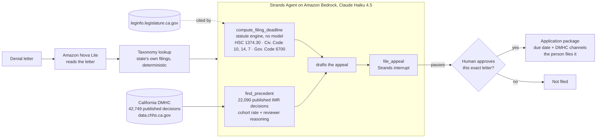

# Day Thirty

An agent that works a California health insurance denial end to end: it tracks the
statutory clock, finds how people actually won cases like yours, drafts the appeal, and
stops for your approval before anything is filed.

The name is the mechanism. On the thirtieth day after you file a grievance, a six month
clock starts whether or not your plan has answered you, and almost nobody knows it
started.

Built with the Strands Agents SDK for the AWS Agents for Humans Hackathon.

**Demo video (2 min):** https://www.youtube.com/watch?v=cKe6B5hYq5s
**Write-up:** https://jonathanandrei.com/blog/day-thirty-california-insurance-appeal-agent/

> Not legal advice. This computes dates and drafts a document. It does not tell anyone
> what to do, and it does not practise law.

## Architecture



Two models, two deterministic engines, one gate. Nova reads unstructured correspondence
because that needs a model; the taxonomy and the deadline are lookups and arithmetic
against published sources, so no model is allowed near them. Haiku writes the letter,
which is the artifact every number below is measured on. Nothing is filed until a person
approves that specific letter, and nothing is filed by the software after that either:
DMHC has no API, so approval produces the finished application with the due date and the
real channels (online, fax, mail), and the person sends it. The page says so on screen.

## Why

Last year insurers denied roughly **85 million** in-network claims on HealthCare.gov.
Consumers appealed **262,982** of them, an appeal rate **under 1%**, and insurers upheld
**66%** of the appeals they did receive.
([KFF, ACA Marketplace 2024](https://www.kff.org/patient-consumer-protections/claims-denials-and-appeals-in-aca-marketplace-plans-in-2024/))

When those denials instead reach an independent physician through California's
Independent Medical Review system, **72.3% were overturned in 2025**, up from 25% in 2001.
([California DMHC, published determinations](https://data.chhs.ca.gov/dataset/independent-medical-review-imr-determinations-trend))

An insurer reviewing its own denial upholds it two times in three. An independent
physician reviewing the same kind of denial overturns it nearly three times in four. The
entire gap is people not filing.

## The deadline nobody knows is running

Under `Cal. Health & Safety Code § 1374.30(j)(3)`, an enrollee "shall not be required to
participate in the plan's grievance process for more than 30 days." So thirty days after
the grievance is filed, whether or not the plan has answered, the qualifying event occurs
and `§ 1374.30(k)` starts a **six month** clock.
([California Legislature, HSC § 1374.30](https://leginfo.legislature.ca.gov/faces/codes_displaySection.xhtml?lawCode=HSC&sectionNum=1374.30.))

Counting six months from the plan's eventual answer therefore puts the deadline roughly
`(response time − 30)` days too late. If the plan takes four months to say no, someone
counting from the no is already about three months past their real deadline.

`src/daythirty/deadlines.py` computes this from the statute. Every rule cites its
provision:

| Provision | Rule |
|---|---|
| `Health & Safety Code § 1374.30(k)` | six months from the qualifying event |
| `Health & Safety Code § 1374.30(j)(3)` | qualifying event: upheld, or 30 days (3 if expedited under § 1368.01) |
| `Civ. Code § 14` | "month" means a calendar month, so the date clamps to month length |
| `Civ. Code § 10` | exclude the first day, include the last, and exclude the last if it is a holiday |
| `Civ. Code § 7` | holidays are every Sunday plus the Government Code list |
| `Gov. Code § 6700` | the holiday list itself |

### What the arithmetic actually does

Swept exhaustively across every grievance-filing date from 2026 through 2029 and every
plan response time from 0 to 180 days (264,441 combinations, `eval/deadline_divergence.py`):

- **17.9%** of computed deadlines land on a day the statute excludes and must move under
  `§ 10`. That is a property of California's calendar, not of any case selection.
- **1.8%** are changed by month-length clamping under `§ 14`.
- The "response time minus 30 days" shortcut gives the right date only **29.2%** of the
  time, deviating by −5 to +3 days.

**What is deliberately not claimed:** the share of those 264,441 combinations where the
intuitive count runs late is 82.7%, and that figure is meaningless. It is fixed by the
0-to-180-day sweep I chose, not by anything about California. Turning it into a headline
would be a parameter of mine dressed up as a finding. A real-world rate needs a published
distribution of plan grievance response times, which is not yet wired in.

### Known gap

Two `§ 6700` holidays are defined astronomically rather than by calendar date: Lunar New
Year ("the second new moon following the winter solstice") and Diwali ("the 15th day of
the month of Kartik in the Hindu lunar calendar"). These cannot be derived from a
Gregorian calendar. They are supplied as data, the tables are currently empty, and every
result carries a caveat saying so rather than implying the year was fully checked.

## The corpus

California publishes every Independent Medical Review determination it has ever made:
**42,749** decisions from 2001 to 2026, each one made by a state-contracted independent
physician reviewer, including the reviewer's written reasoning.

Splits are temporal and leak-controlled (`eval/build_split.py`): precedent is retrieved
only from the 22,090 decisions of 2016 to 2024, held-out cases are the 3,276 of 2025 to
2026, and the reviewer's narrative is stripped from every held-out case because it
states the verdict outright. Cases before
2016 are dropped entirely: DMHC only began publishing the structured narrative in 2015,
so earlier records are unstructured prose and cannot serve as precedent
(`eval/structure_by_year.py`).

### What the agent does not try to do

Predict whether you will win. That was the original plan and it was measured out on day
one. On the 3,276 held-out denials the overturn base rate is 71.89%, so always saying
"appeal" scores 0.7189. Deterministic precedent lookup scores 0.7234, a lift of **+0.005**.
Outcome prediction from what a patient knows at denial time is a dead end, and building a
headline on it would have produced a number indistinguishable from a constant.

What is worth saying is not a prediction at all. The published overturn rate for a matched
cohort ranges from **5.0% to 98.6%** (median 65.0%). Telling someone that California's
reviewers overturned denials like theirs 98.6% of the time, or 5%, is a count over the
state's record rather than a guess, and it is the difference between fighting and giving
up.

## Retrieval

Measured across all 3,276 held-out denials (`eval/precedent_coverage.py`):

| | |
|---|---|
| Get a published overturn rate for their situation | **91.5%** |
| Get at least one usable exemplar to argue from | **84.1%** |
| Exemplars at the tightest match (exact diagnosis, treatment and grounds) | **72.4%** |

An exemplar must match on diagnosis category, treatment category and grounds at minimum.
A looser floor was tried and rejected: it offered a Saxenda obesity case as precedent for
a hepatitis antiviral denial, because at the coarsest tier every pharmacy case matches
equally. The remaining **15.9%** get an honest "no close enough published decision"
instead of a misleading one.

## Reading the letter

Real people do not have database fields. They have a letter from their plan. Amazon Nova
reads it (`src/daythirty/intake.py`) and pulls out the condition, the treatment, the
grounds and the dates.

The taxonomy mapping is **not** done by the model, and that was a correction. Asking Nova
for California's category directly scored 30% exact, and reading the misses showed why:
the state files `Speech Therapy` under `Autism Related Tx` and `Arthritis` under
`Immuno Disorders`, classifying by patient context and disease mechanism. A letter does
not contain that. It is not inference, it is a lookup, and the corpus already answered it
42,749 times. So the model reads, and the subcategory-to-category mapping comes from the
state's own filings (`scripts/build_taxonomy.py`).

Moving that boundary took diagnosis category from 30.0% to **66.7%** and treatment
category from 33.3% to **83.3%**.

Scored on 30 held-out cases, against the label California itself assigned
(`eval/intake_accuracy.py`, report in `eval/intake_report.json`):

| | |
|---|---|
| Denial grounds | **30/30 (100%)** |
| Denial date read off the letter | **30/30 (100%)** |
| Treatment category, exact | **25/30 (83.3%)** |
| Diagnosis category, exact | **20/30 (66.7%)** |
| Diagnosis category, allowing DMHC's own synonyms | **26/30 (86.7%)** |

The remaining errors are largely California disagreeing with itself. 4.9% of diagnosis
subcategories and 7.0% of treatment subcategories have been filed under more than one
category over the years, and three of the misses are cases where the state's own
treatment subcategory is the literal string `"Other"`. The synonym groups used for the
second row are listed in the eval script rather than hidden.

## The agent

Three tools and a gate (`src/daythirty/agent.py`):

- `compute_filing_deadline` is deterministic. No model touches the date arithmetic,
  because a hallucinated deadline is the one error that cannot be recovered from.
- `find_precedent` is deterministic retrieval over the state's published record.
- `file_appeal` raises a Strands interrupt. Nothing is filed without a person approving
  that specific letter. On approval it returns the application package: the statement,
  the due date, and where DMHC accepts it (www.HealthHelp.ca.gov, fax 916-255-5241, or
  the Help Center's mailing address, verified 2026-09-12). The web surface writes that
  package to `outbox/`. The tool never claims a submission it did not make.

The model writes the appeal. That is deliberate: the letter is the artifact the numbers
below are measured on, so the model has to be what produces it.

### Measured

Across real held-out denials, live on Bedrock:

- Approval gate reached **5/5** (`eval/agent_reliability.py`)
- Median denial to drafted appeal waiting at the gate: **15.1 seconds**
- Mean drafted letter: 3,218 characters

### Is the letter grounded in the record?

Checked mechanically, not by asking a model to grade a model
(`eval/grounding.py`, report in `eval/grounding_report.json`). A Strands
`AfterToolCallEvent` hook captures exactly what the tools returned, then every checkable
specific in the letter (percentages, doses, named clinical authorities) is matched
against it.

Across 20 letters on 20 different real denials:

| | |
|---|---|
| Numeric claims grounded in the record | **18/18 (100%)** |
| Named clinical authorities grounded | **12/13 (92.3%)** |
| Negative control: fabricated claims correctly flagged | **7/7** |

The negative control exists because a checker that cannot fail proves nothing. Seven
plausible fabrications (`42.7%`, `InterQual`, `American Academy of Ophthalmology` and
others) are tested against the union of all captured context and must all be caught.

The one miss is real: a letter cited the American Society of Addiction Medicine where the
retrieved record had not named it. ASAM criteria do govern that kind of case, so the
citation is plausible, but the agent did not get it from the record and the check marks
it down. Earlier, smaller runs also showed one ungrounded number in ten letters, so
expect this to vary by a claim or two between runs rather than treating 100% as fixed.

## What each piece contributes, measured by switching it off

Every entry at a sponsored hackathon asserts its tools were essential. This measures it
(`eval/ablation.py`, report in `eval/ablation_report.json`). Same model, same six real
denials, same prompt, one tool removed at a time.

**California's published record switched off.** The model argues from its own knowledge.

| | rate claims in the letters | sourced |
|---|---|---|
| with the record | 12 | **12 (100%)** |
| without it | 6, in 3 of 6 letters | **0** |

Without the record the model asserted overturn rates of **40%, 50% and 60%** with nothing
to cite. The state's published figures for those same cohorts run from 64% to 95%. The
numbers were not just unsourced, they were wrong in the direction that talks a person out
of filing.

**The statute engine switched off.** The model is told the rule in words, the way a
careful person would look it up, and asked to compute the date itself.

| timeline | exact | early | **late** | error in days |
|---|---|---|---|---|
| plan silent | 0/6 | 6 | 0 | mostly −42 |
| plan answered on day 120 | 0/6 | 1 | **5** | **+86** in all five |

The −42 is six months counted from the denial letter instead of from the qualifying
event. The +86 is six months counted from the plan's answer. **Late means the filing
window is missed and the appeal is lost.** Told the rule, the model still made the exact
mistake the project exists to prevent, five times out of six.

## Deployed on Bedrock AgentCore

The same agent runs in AWS's managed runtime, so it works in the background rather than
on a laptop (`agentcore_app.py`). Deployed 2026-09-12 to
`arn:aws:bedrock-agentcore:us-east-1:533354334997:runtime/daythirty-SGLNmB3qzW`, built as
an ARM64 container by CodeBuild in 41 seconds.

Invoked with a real published GERD denial (`scripts/invoke_agentcore.py --case 5`), the
runtime returned in **14.2 seconds** round trip with the intake, the statutory deadline
(qualifying event 2026-07-18, deadline 2027-01-19), and a 2,361-character drafted appeal
stopped at the gate. The response says, in words, that nothing has been filed and that
filing requires a person. The runtime never files.

AWS surface in the judged path: Strands Agents SDK, Bedrock (Amazon Nova Lite for
intake, Claude Haiku 4.5 for drafting), AgentCore Runtime, ECR, CodeBuild, S3,
CloudWatch. Every resource is listed in `TEARDOWN.md` with the date it comes down.

## Running it

```
python -m venv .venv && .venv/Scripts/pip install -r requirements.txt
python scripts/fetch_corpus.py        # 85 MB from the state's open data portal
python eval/build_split.py            # temporal, leak-controlled splits
python scripts/build_taxonomy.py      # the state's own category filings
.venv/Scripts/uvicorn app:app --port 8030   # then open http://127.0.0.1:8030
python run_agent.py                   # the same run, in a terminal
pytest                                # 20 tests, no environment setup needed
```

The web surface (`app.py`, `web/index.html`) streams every stage as it happens. The
insurer's letter is typeset in the insurer's own boring type; everything Day Thirty does
is drawn on it by hand, in a litigator's ink, and the gate is a signature line. Design
decisions and their reasons are in `.design/manifest.json` and at the top of the
stylesheet.

Requires AWS credentials with Bedrock access in `us-east-1`.

## Honest limitations

- **California only.** The statute engine encodes the Knox-Keene Act. Other states have
  different clocks.
- **Two holidays are unimplemented.** See the known gap above. Every result says so.
- **The demo's dates are constructed.** The clinical facts of each case are real and
  published; the denial and grievance dates are not, because DMHC does not publish them.
- **A format shift sits between the corpus halves.** Mean narrative length fell from
  2,926 characters in 2023 to 1,828 in 2025, so precedent is drawn from slightly
  differently written decisions than the held-out cases.
- **`find_precedent` is taxonomy-matched, not semantic.** That is why 15.9% of denials get
  no exemplar. Embedding retrieval would reach cases the state's categories separate but
  medicine does not. This was attempted with `amazon.nova-2-multimodal-embeddings-v1:0`
  (`scripts/build_embeddings.py`, which works and is kept) and abandoned on cost: at 16
  concurrent workers this account lost 46% of calls to throttling, and the sustainable
  rate put the 12,570-record exemplar pool at several hours. The script is left in place
  because the approach is right; the index is not built.
- **The denial letter is rendered, not captured.** DMHC publishes determinations, not the
  plan correspondence behind them, so no real letter exists to download for a published
  case. The clinical facts in every letter are the state's; the letterhead is not. Note
  this also makes the intake score conservative in one direction and generous in another:
  the letter uses DMHC's own clinical descriptors rather than a real plan's wording.
- **Filing is a hand-off, not an API call.** DMHC accepts IMR applications through its
  online form, by fax or by mail, and publishes no API. Approval therefore ends with the
  finished application and its due date in the person's hands, and the page says
  "that last step is yours" rather than stamping something it did not do.

## Status

Built for the September 14 2026 deadline. See `DEMO_SCRIPT.md` for the locked narration.

## Licence

MIT. See `LICENSE`.
